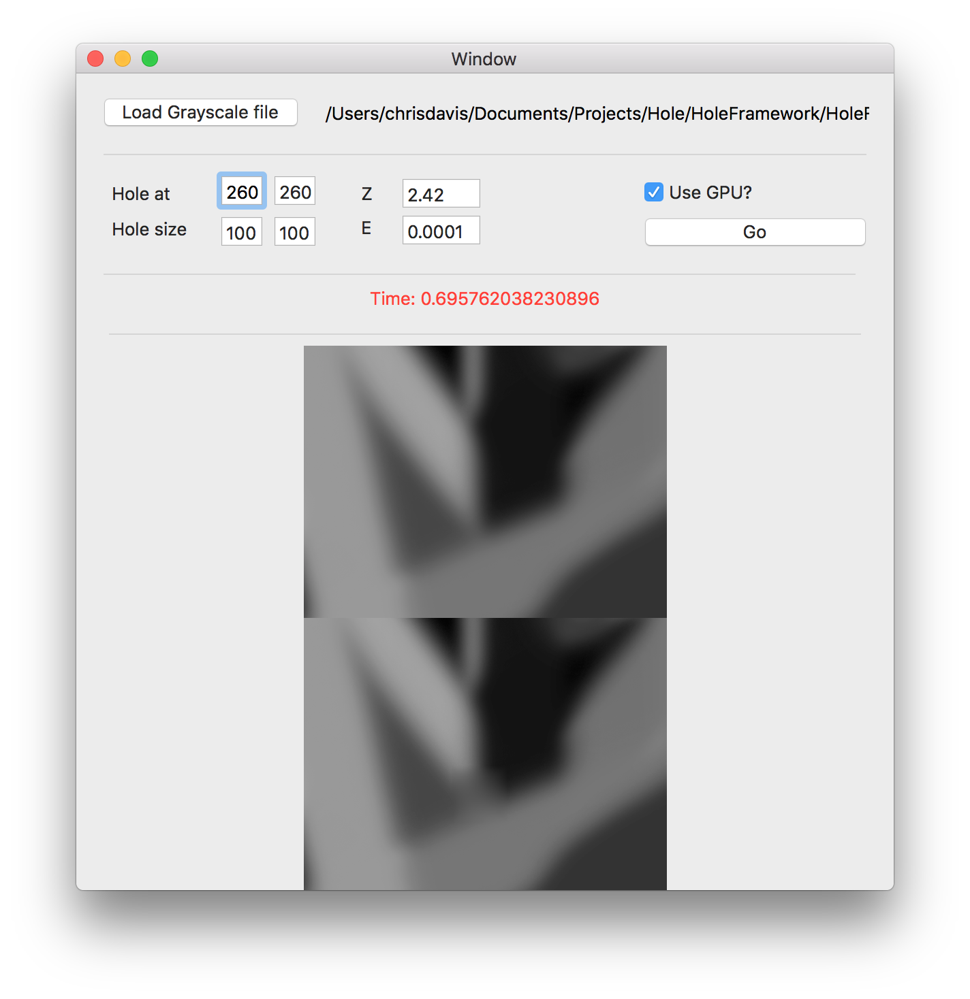

# Hole Filling
by Chris Davis - contact@chrisdavis.com

## Introduction

Please see the attached [PDF](Documents/Hole_Filling_-_Interview_Exercise.pdf) for a more detailed spec of the tasks.

## Overview

I was given the task of following the four points in the PDF.

In the development of the program I made a CPU and GPU versions, after I found the CPU version was slow.

The GPU version is an order of magnitude faster at least.

#### Step 1

I wrote an algorithm to find the 8 or 4 connected pixels to find the edge. CPU & GPU versions. You can find this in HoleFillerCPU or Shaders.metal

#### Step 2

I implemented the calculus function to fill the missing pixels, CPU & GPU versions. You can find this in HoleFillerCPU or Shaders.metal

#### Step 3

If there are `m` boundary pixels and `n` missing pixels, I think the time complexity of the algorithm is O(n^<sup>2</sup>)

#### Step 4

Write an algorithm that approximates step 2. Todo.

## Getting started

Open the Hole.xcworkspace file.

In there you will see:

`HoleFramework` - This is where the logic exists for the function, it's shared between the command line and mac app.

`HoleCommandLine` - This is the command line app

`HoleMacApp` - This is the mac app

## Mac App

Whilst not in the spec, I made a mac app for quick ease of use for testing different parameters



## Command Line App

To get help just run

```HoleCommandLine```

to get the help screen.

```Help:
-p, Use the cpu or gpu implementation
-i, Path to an image
-z, pow for weighting function
-e, epslion value, small positive
-h, Rectangle co-ordinates for a hole, x,y,width,height
-o, Path to save computed image to
```

You can run a full example like this:

```HoleCommandLine -p gpu -i /Users/chrisdavis/Documents/Projects/Hole/HoleFramework/HoleFrameworkTests/grey3.png -z 2.42 -e 0.0001 -h 30,30,100,100 -o /Users/chrisdavis/Documents/Projects/Hole/HoleFramework/HoleFrameworkTests/grey3_new.png```

